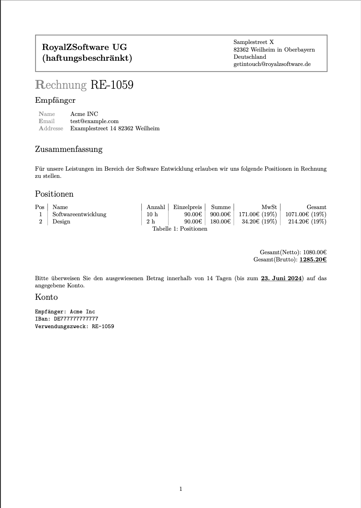

# Invoices LaTeX Template
## by RoyalZSoftware UG

## Example


## Capabilities
Just enter the positions inside the yaml data block of your invoice template and generate it. There you have your finished invoice with:
- due date (in days and resolved to actual date)
- with tax, without tax, etc.
- versioned as markdown/yaml files

## Usage
Use pandoc!

You need the advdate.sty package.

See `create-invoice.sh` for reference or run it by

```bash
$ sh create-invoice.sh example # example is the filename of invoices/
```

This will create a pdf file `archive/example.pdf`